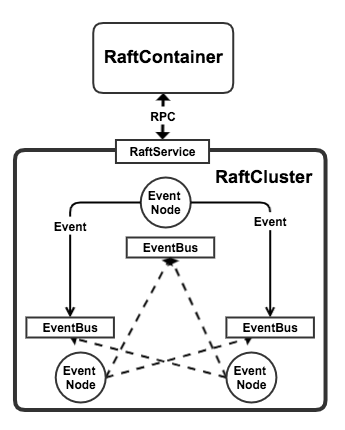
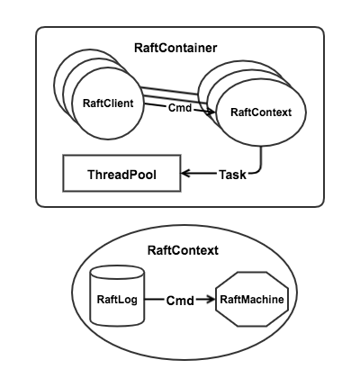

# rafting
### Raft library implemented in Java, easy to understand

- Complete features including `AppendEntires`, `RequestVote`, `InstallSnapshot` and `PreVote`
- Design focuses on understanding
- Asynchronous lock-free implementation using EventLoop
- Multi-Raft is supported

### Architecture

#### According to the paper:
- Nodes communicate with RPC `RaftService`. 
So we provide an Event-Based async RPC Framework based on **Netty** and **Kyro** in `io.lubricant.consensus.raft.transport`. 

- Basic operation `Leader Election`, `Log Replication` and `Snapshot Synchronization` are included in `io.lubricant.consensus.raft.context`.
Besides, we define `RaftContext` concept to isolate irrelevant state machine and provide better concurrency.

- For reliable log persistence, we provide `RaftLog` which storage its entries in **RocksDB**. 

- `RSM` model could adapt to various application by change its `SateMachine`. So
we provide `RaftMachine` interface, and developer could crate unique Raft application by customizing their own `RaftMachine`.

- `PreVote` and `InstallSnapshot` are optional for developers and could be disabled

### Correctness verification
To show the function of this lib, we simply implement a RaftMachine which only append the data on a file.

Run these 3 main class `TestNode1~3` to setup a cluster then try to stop and restart these processes.

If system is functional, all 3 files should be consistent.

